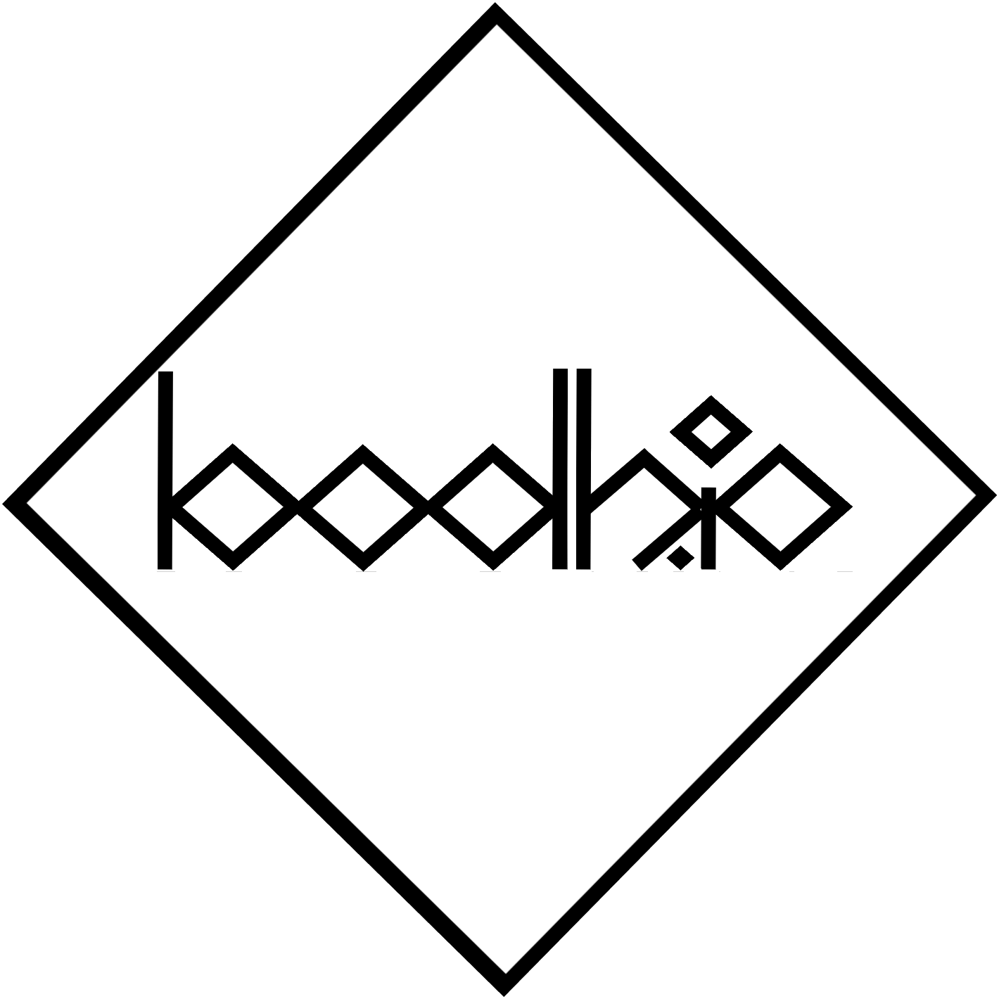

<h1 align="center">Prints by Brian</h1>

## About

To help bridge the gap between the art that I produce and the technology that I use, I decided to create a website which provides a place to curate my creations in an online realm. 

## Contact

I am open to commissions, collaboration, and general feedback. If you are interested contacting me for any reason, here is how you can get in touch:

- Slide into my DMs on <a href="https://intagram.com/bodh.io" target="_blank">Instagram</a>
- Send me an <a href="mailto:b.r.hendrick@gmail.com" target="_blank">email</a>

## Credits

bodh.io is built, designed, and managed completely on a web-browser, the only expenditure was on the domain name and the of course time/effort. Here are some of the digital products and tools which have enabled bodh.io to exist in its current form:

*  <a href="https://github.com/daattali/beautiful-jekyll" target="_blank">Beautiful Jekyll</a> template by <a href="http://deanattali.com" target="_blank">Dean Attali</a> who provides a brilliant <a href="http://deanattali.com" target="_blank">read-me</a> which guides you how to set-up your own website just like this one within seconds.
* [Cloudflare](https://cloudlfare.com) - for SSL certificate and cache.
* [GitHub Pages](https://pages.github.com/) - for free web hosting.
* [Jekyll](https://jekyllrb.com/) - static website generator which this website is built on.
* <a href="https://pixlr.com" target="_blank">Pixlr Editor</a> - web application which the logo was created and images are formated. 
